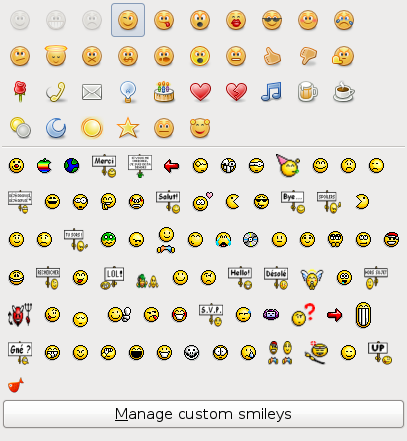

Pidgin JeuxVideo.com Smileys
============================

[JeuxVideo.com](http://www.jeuxvideo.com/) smileys for Pidgin.

Overview
--------



Description
-----------

This repo contains the custom smileys directory and XML file to provide
the JeuxVideo.com smileys to Pidgin, together with the script that generated
the smiley files and the XML file (see `smileys-xml` script).

The script expects a list of smileys (code and file) in standard input,
and will dump the XML on standard output, while renaming smiley files
to the Pidgin convention (SHA-1 sum as filename). Thus, it needs to be
run in the same directory where the smileys resides.

Installation
------------

Copy `custom_smiley` and `smileys.xml` in `~/.purple`.

Examples
--------

Using [JeuxVideo.com Tools](https://github.com/valeriangalliat/jvc-tools) to
retrieve the smileys list, this is how I generated the static files and XML
in this repo (see the makefile):

```sh
mkdir custom_smiley
cd $_

smileys | pee \
    'awk "{print \$2}" | smileys-dl' \
    'smileys-xml > ../smileys.xml'
```
